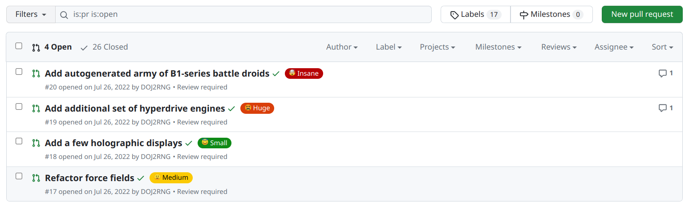

# PR Size Labeler

This Github Action adds labels and comments to a PR depending on its diff size.
In practice, this looks like the following:

### A label on the PR



### A comment in the PR


## Example Usage

Add a new workflow file to the directory `.github/workflows/`.
We recommend a name such as `label-pr-size.yml`.

```yml
name: Label PRs based on size

on: [pull_request]

jobs:
  add_pr_size_label:
    runs-on: [docker]
    name: Check PR size
    container:
      image: ubuntu:22.04

    steps:
      - name: Label and comment PR
        uses: boschresearch/pr-size-labeler@v5
        # Uncomment these lines if you want to use your own custom configuration
        # with:
        #   bucketConfigFile: "<PATH_TO_YOUR_BUCKET_CONFIG>"
```

Note that this workflow runs only on pull requests but not on pushes to
branches.
If you have another workflow that runs only on pull requests, you can also add
the relevant two steps to it instead of creating a new workflow.

## Inputs

### `github-token`

The GitHub token used to create an authenticated client.

**Default:** `github.token`, which is available within GitHub workflows.
This token is used only to modify the labels in the PR.
There should be no need for you to specify it explicitly.

### `bucketConfigFile`

A yaml file defining the buckets for the sizes.

**Default:** Can be found [here](defaultBuckets.yml)
and looks like:

```yml
buckets:
  - maxSize: 80
    label: 😇 Small
    comment: null
  - maxSize: 200
    label: 🙂 Medium
    comment: null
  - maxSize: 2000
    label: 😵 Huge
    comment: >
      👮‍♀️⚠️ This is a friendly reminder that the diff size of this PR is bigger than 
      200 lines we aim for. Please consider splitting this PR into more digestible pieces!
  - maxSize: Infinity
    label: 🤯 Insane
    comment: >
      👮‍♀️🛑 This PR's diff size is quite huge. 
      Hopefully you know what you're doing. 
      If you did not commit a lot of autogenerated files intentionally, 
      there are few good reasons for this.
```

## License

PR Size Labeler is open-sourced under the Apache-2.0 license. See the
[LICENSE](LICENSE) file for details.
For a list of other open source components included in PR Size Labeler, see the
file [3rd-party-licenses.md](3rd-party-licenses.md).
